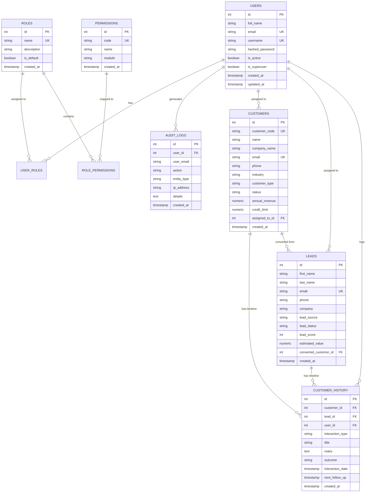

# SmartERP — System Architecture & Design Specification

## 1. Architectural Overview

SmartERP is designed as a modular, enterprise-grade Enterprise Resource Planning platform. The architecture implements strict separation of concerns, domain-driven boundaries, and role-based access controls (RBAC) to allow independent team member modules to be added seamlessly without restructuring existing services.

```mermaid
graph TD
    Client[React + Vite Single Page Application] -->|HTTP / JSON + Bearer JWT| API_GW[FastAPI REST API Gateway /api/v1]
    
    subgraph Backend Architecture
        API_GW --> Middleware[CORS & Request Logging Middleware]
        Middleware --> AuthRoutes[Module 1: /auth & /users Routes]
        Middleware --> CRMRoutes[Member 3: /crm Routes]
        Middleware --> AuditRoutes[/audit Routes]
        Middleware --> FutureRoutes[Future Stubs: /hr, /inventory, /sales, /procurement, /finance, /reports]
        
        AuthRoutes --> AuthService[Auth & Security Service]
        AuthRoutes --> UserService[User Management Service]
        CRMRoutes --> CRMService[CRM Business Logic Service]
        AuditRoutes --> AuditService[Security Audit Service]
        
        AuthService --> DB[(PostgreSQL Database / SQLite Fallback)]
        UserService --> DB
        CRMService --> DB
        AuditService --> DB
    end
```

---

## 2. Team Module Allocation & Phase 1 Scope

| Member | Responsibility | Status in Current Phase | Deliverable |
|---|---|---|---|
| **Member 1** | **Authentication & Security** | **Fully Functional** | Login, Register, JWT, Roles, Permissions, Security Audit Logs, Password Management |
| **Member 2** | HR Management | Planned for Phase 2 | Employees, Departments, Attendance, Leave (Placeholder API & UI) |
| **Member 3** | **CRM (Customer Relationship Management)** | **Fully Functional** | Customers, Leads Pipeline, Customer History & Interactions, Conversion |
| **Member 4** | Inventory | Planned for Phase 2 | Products, Categories, Warehouses, Stock Control |
| **Member 5** | Sales | Planned for Phase 2 | Quotations, Sales Orders, Invoices, Payments |
| **Member 6** | Procurement & Finance | Planned for Phase 2 | Suppliers, Purchase Orders, Expenses, Ledger |
| **Member 7** | Dashboard & Integration | Integrated Baseline | System overview, module readiness tracker, integration tests |

---

## 3. Database Entity Relationship Model



---

## 4. Security Principles

1. **Password Protection**: Passwords are cryptographically hashed using industry-standard **bcrypt** via Passlib with salt auto-generation. Plaintext passwords are never stored, logged, or serialized in any API response.
2. **Stateless JWT Tokens**: Authentication uses signed **JSON Web Tokens (HS256)** containing user claims, token expiration, and subject ID. Bearer authorization headers validate incoming requests.
3. **Role-Based Access Control (RBAC)**: Fine-grained permissions are associated with roles (`ADMIN`, `MANAGER`, `EMPLOYEE`). Dependencies verify user authorizations before controller execution.
4. **Immutable Security Audit Trail**: Every sensitive operation (login, login failure, password update, user registration, customer deletion) is recorded in `audit_logs` with actor IP address and timestamps.
